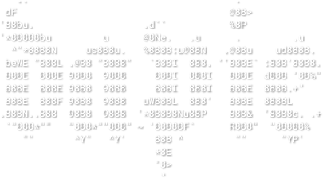

<p align="center">
    <picture align="center">
        
    </picture><h3 align="center">Notcoin autoclicker</h3>
</p>
<p align="center">
    Small script to automatically clicks on coin, collect rockets and use available boosts. Works well in one session. You can change a timeouts by changing variables if you need.
</p>

### Run Notcoin in browser
This method allows you to use only one session (you don't need to recreate it everytime)

1. Open [Telegram Web](https://web.telegram.org)
2. Open [Notcoin Bot](https://web.telegram.org/k/#@notcoin_bot)
3. Open Dev Tools (`Command+Option+I / F12 or Control+Shift+I`)
4. Press `Command+O / Control+O` and open file `telegram-web-app.js`.
5. In file find string `Object.defineProperty(WebApp, 'platform',`, it should be on 1325 position
6. Change `return webAppPlatform;` to `return 'ios';` and [save for overrides](https://senuravihanjayadeva.medium.com/local-overrides-in-chrome-devtools-f4a148de30c2#:~:text=Locate%20the%20file%20you%20want,overrides%E2%80%9D%20from%20the%20context%20menu.) this file
7. Refresh the page and try to open Notcoin Bot by clicking `Mine Notcoin`

If you can see the coin and doesn't see an message that you should use mobile then everything is ok

### Run autoclicker
(warn) Look at `click` requests (if it is start to fail - you should to change session)

1. Open bot window in Noticon Bot
2. Open Dev Tools (`Command+Option+I / F12 or Control+Shift+I`)
3. Change [JavaScript Context](https://developer.chrome.com/docs/devtools/console/reference#context) by pressing `top` selector at the top of console and choose `clicker`
4. Insert the script and press enter

If something breaks, just reload the page and run autoclicker again from first step

### Script

```javascript
let intervalId;
let clicksCount = 0;
const delay = (time) => new Promise(r => setTimeout(r, time));
const getEvent = () => ({
    touches: [{clientX: Math.random() * 250 + 52, clientY: Math.random() * 582 + 512}]
})
const getReactProps = (component) => component ? Object.entries(component).find(([key]) => key.startsWith("__reactProps$"))[1] : null;
const getIdleTime = () => Math.floor(Math.random() * 18222 + 12111);
const getRandomClickTime = () => Math.floor(Math.random() * 142 + 12);

const MIN_SCORE = 500;
const MAX_CLICKS_PER_ITERATION = 100;
const coinClick = async () => {
    const coin = document.querySelector('div[class^="_notcoin"]');
    const scoreElement = document.querySelector('div[class^="_scoreCurrent"]');
    const score = scoreElement ? parseInt(scoreElement.textContent) : 0;

    // Rocket click
    const rocket = document.querySelector('img[class^="_root"]');
    const rocketProps = getReactProps(rocket);
    if (rocketProps) rocketProps.onClick();

    // Coin click
    if (score > MIN_SCORE && clicksCount < MAX_CLICKS_PER_ITERATION && coin) {
        clicksCount++;
        const {onTouchStart, onTouchEnd} = getReactProps(coin);
        onTouchStart(getEvent());
        await delay(50);
        onTouchEnd();
    } else {
        clearInterval(intervalId)
        clicksCount = 0;
        console.info('%c INFO: idle time', 'color: #64b5f6');
        if (score < MIN_SCORE) boostClick()
        await delay(getIdleTime());
        if (intervalId === null) return;
        console.info('%c INFO: trying again', 'color: #64b5f6');
        start();
    }
}

const start = () => intervalId = setInterval(coinClick, getRandomClickTime());
const end = () => {
    clearInterval(intervalId);
    intervalId = null;
};

const BOOST_CLICK_TIMEOUT = 1500;
const boostClick = async () => {
    console.info('%c INFO: open boosts', 'color: #64b5f6');
    const buttonGroup = document.querySelector('div[class^="_buttonGroup"]');
    const boostButton = buttonGroup && getReactProps(buttonGroup.lastChild);
    await delay(BOOST_CLICK_TIMEOUT);
    if (!boostButton) return;
    boostButton.onClick();
    await delay(BOOST_CLICK_TIMEOUT);
    const dailyTask = document.querySelector('div[class^="_taskDailyItem"]:not([class*="_completed"])');
    const dailyBoost = getReactProps(dailyTask);
    const taskCarousel = document.querySelector('div[class^="_taskCarousel"][class*="_willChange"]');
    const boost = getReactProps(taskCarousel && taskCarousel.querySelector('div[class*="_rippleEffect"]'));
    const boosterButton = dailyBoost || boost;
    if (boosterButton) {
        boosterButton.onClick();
        await delay(BOOST_CLICK_TIMEOUT);
        const getButton = getReactProps(document.querySelector('button[class*="_typeBlue"]'));
        if(getButton) getButton.onClick();
        await delay(BOOST_CLICK_TIMEOUT);
        console.info('%c DONE: boosted', 'color: #bada55');
    }
    console.info('%c INFO: close boosts', 'color: #64b5f6');
    history.back();
}

start();
```
